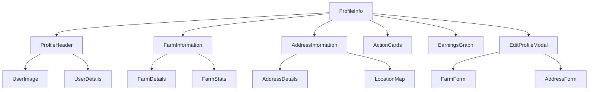
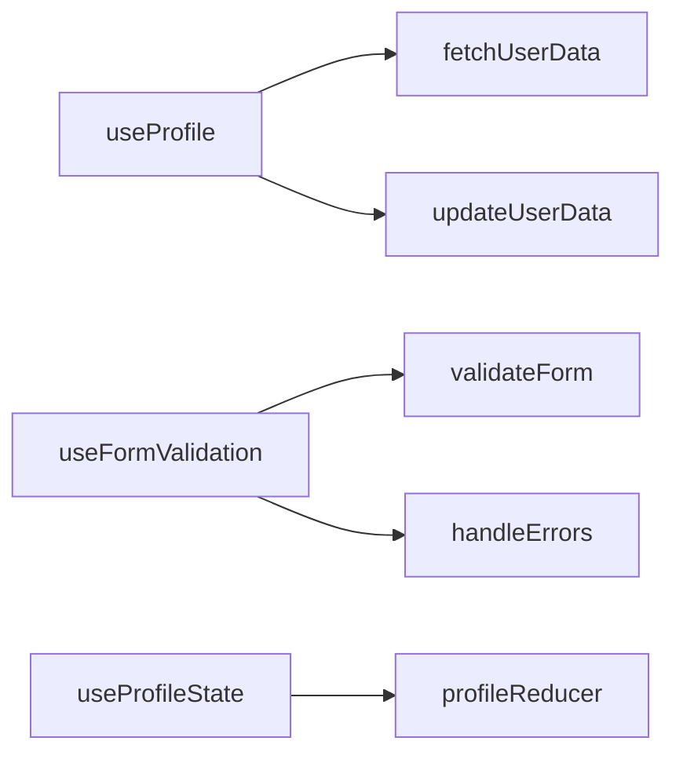

# ProfileInfo Component Redesign Plan

## 1. Component Structure Reorganization

## 2. Custom Hooks Implementation

## 3. Technical Implementation Details

### State Management
- Implement useReducer for complex profile state
- Create custom hooks for data fetching and form handling
- Add proper loading and error states
- Implement data caching for better performance

### Form Handling
- Add comprehensive form validation
- Implement field-level validation with error messages
- Add form submission loading states
- Improve error handling and user feedback

### Performance Optimizations
- Use React.memo for static components
- Implement proper code splitting
- Add skeleton loaders for better loading UX
- Optimize re-renders with useMemo and useCallback

### Accessibility Improvements
- Add ARIA labels throughout
- Implement keyboard navigation
- Ensure proper heading hierarchy
- Add screen reader support
- Improve focus management

### Mobile Responsiveness
- Implement mobile-first design approach
- Add proper breakpoints
- Optimize touch targets for mobile
- Improve image loading on mobile
- Add swipe gestures where appropriate

## 4. UI/UX Enhancements

### Visual Design
- Modern card-based layout
- Consistent spacing system
- Improved typography hierarchy
- Better color contrast
- Smooth transitions and animations

### User Experience
- Add profile completion indicator
- Implement better loading states
- Add confirmation dialogs for important actions
- Improve form field validation UX
- Add toast notifications for user feedback

### Profile Sections
1. **Profile Header**
   - Larger profile image
   - Better organized user details
   - Quick action buttons

2. **Farm Information**
   - Improved data visualization
   - Better organized farm stats
   - Quick edit capabilities

3. **Address Information**
   - Clean layout for address details
   - Location map integration
   - Easy edit access

4. **Action Cards** (Unchanged)
   - Maintain existing functionality
   - Improve visual consistency
   - Better hover states

5. **Earnings Graph**
   - Responsive graph implementation
   - Better data visualization
   - Interactive elements

6. **Edit Profile Modal**
   - Improved form layout
   - Better field organization
   - Clearer validation messages

## 5. Testing Strategy

### Unit Tests
- Test all custom hooks
- Validate form functionality
- Test state management
- Test API integration

### Integration Tests
- Test component interactions
- Validate user flows
- Test form submissions
- Test error scenarios

### Accessibility Tests
- Screen reader compatibility
- Keyboard navigation
- Color contrast compliance
- ARIA attributes

### Responsive Tests
- Multiple viewport sizes
- Different devices
- Touch interactions
- Loading states

## 6. Implementation Steps

1. **Phase 1: Project Setup**
   - Set up TypeScript
   - Configure testing environment
   - Set up CSS modules
   - Configure build process

2. **Phase 2: Core Components**
   - Implement new component structure
   - Create custom hooks
   - Set up state management
   - Implement base styling

3. **Phase 3: Form Handling**
   - Implement form validation
   - Add error handling
   - Create form components
   - Add field validation

4. **Phase 4: UI/UX Implementation**
   - Add responsive styles
   - Implement animations
   - Add loading states
   - Improve error states

5. **Phase 5: Testing & Optimization**
   - Write unit tests
   - Add integration tests
   - Perform accessibility audit
   - Optimize performance

## 7. Success Metrics

- Improved Lighthouse scores
- Better accessibility ratings
- Faster loading times
- Reduced error rates
- Better mobile usability scores

## Next Steps

1. Review and approve the plan
2. Set up development environment
3. Begin implementation in phases
4. Regular testing and validation
5. Deploy and monitor performance

Note: All existing functionality related to ManageInstruments, InstrumentRented, MoneyEarned, Contracts, and History & Rating components will remain unchanged.